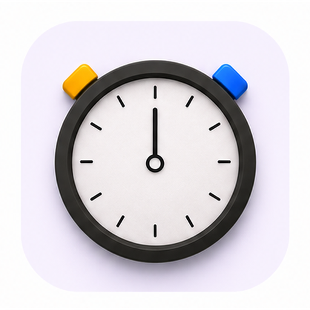

<p align="center">
  
</p>

<h1 align="center">StopWatch Skill</h1>

<p align="center">
  A reusable Codex workflow and browser-first HTML framework for designing StopWatch hardware apps before migrating them into Mooncake/LVGL firmware.
</p>

## Overview

StopWatch Skill keeps app development close to the real hardware model:

- Prototype the round-screen UI in a browser.
- Mirror the StopWatch button model, timing, audio, and vibration behavior.
- Confirm interaction details visually before touching firmware.
- Move the confirmed behavior into Mooncake/LVGL app modules with a repeatable checklist.

The goal is not to build a generic web app kit. It is a focused workflow for StopWatch apps where the browser prototype is the source of interaction truth.

## What This Repo Contains

```text
.
├── html-framework/
│   └── index.html
├── site/
│   ├── assets/
│   │   └── icon_stopwatch.png
│   └── index.html
└── skill/
    └── stopwatch-development/
        ├── SKILL.md
        ├── agents/
        ├── assets/
        └── references/
```

## Components

`skill/stopwatch-development/`

Codex skill instructions for developing StopWatch apps. It documents the expected repo layout, Mooncake/LVGL app pattern, HTML parity rules, and validation flow.

`html-framework/index.html`

A standalone vanilla HTML/CSS/JS prototype starter. It runs directly through `file://` and is meant to be copied into each app repo as `web/index.html`.

`site/index.html`

The Skill homepage. It explains the workflow and embeds the HTML framework preview for local review or GitHub Pages deployment.

`site/assets/icon_stopwatch.png`

Shared StopWatch brand icon used by the homepage and Skill presentation.

## Quick Start

Open the Skill homepage:

```bash
open site/index.html
```

Open the prototype framework directly:

```bash
open html-framework/index.html
```

Use the framework for a new app:

```bash
mkdir -p web
cp html-framework/index.html web/index.html
```

Then edit `web/index.html` for the new app's state machine, drawing logic, input handling, audio, and vibration model.

## Using The Codex Skill

Point Codex at the Skill directory when starting a new StopWatch app:

```text
Use the StopWatch development skill at:
/path/to/stopwatch-skill/skill/stopwatch-development
```

Expected workflow:

1. Build or update the browser prototype first.
2. Validate layout, state transitions, input semantics, timing, and feedback.
3. Migrate the confirmed behavior into the Mooncake/LVGL hardware app.
4. Build, flash, and test on the connected StopWatch device.
5. Keep the prototype and firmware behavior aligned.

## Design Rules

- The first screen should be the usable app experience, not a landing page.
- The browser prototype should mirror the circular display and hardware buttons.
- App-specific HTML should remain dependency-free unless there is a clear reason.
- Hardware migration should preserve the prototype state machine and timing rules.
- Audio and vibration behavior should be specified in the prototype before firmware implementation.

## Validation

For a prototype:

```bash
open web/index.html
```

Check:

- Round-screen layout fits the StopWatch viewport.
- Buttons match the hardware semantics.
- State changes have no hidden browser-only assumptions.
- Timing, audio, and vibration rules are explicit.

For firmware migration, use the validation notes in:

```text
skill/stopwatch-development/references/validation.md
```

## Related Repositories

- [M5StopWatch-UserDemo](https://github.com/xuruiray/M5StopWatch-UserDemo)
- [Ratchet-StopWatch](https://github.com/xuruiray/Ratchet-StopWatch)
- [Schulte-StopWatch](https://github.com/xuruiray/Schulte-StopWatch)
